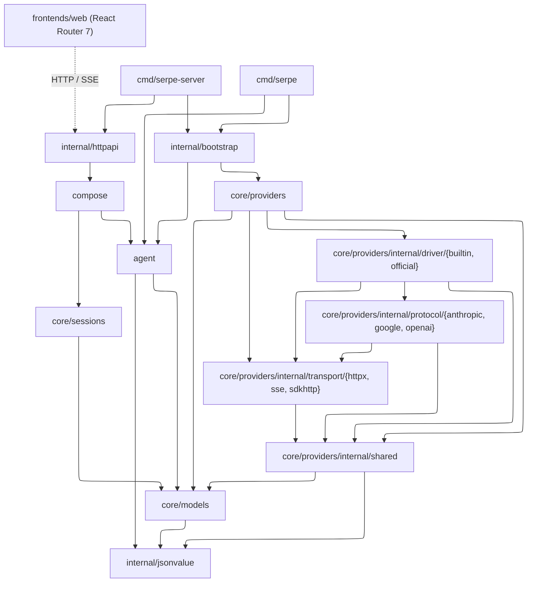

# serpe

Serpe is an agent harness. It owns the loop around a model: assembling
context, streaming responses, executing tool calls, appending their results,
and continuing until the run completes.

## Dependency graph



Solid arrows show the primary Go dependency paths. Direct imports already
represented transitively are omitted for readability. The dotted arrow marks
the Web frontend's HTTP/SSE boundary.

`agent` never imports `core/sessions` or `core/providers`. `compose` is the
application seam that joins `agent.Runner` with `sessions.Manager` for a
single turn boundary. `internal/httpapi` receives one
`agent.Runner`/`sessions.Manager`
pair and constructs that seam itself, so CRUD operations and turns cannot be
wired to different stores. `internal/bootstrap` owns provider/model/tool
construction shared by both commands. `internal/jsonvalue` is a leaf used by
`core/models`, `agent`, `internal/httpapi`, and
`core/providers/internal/shared`.

## Modules

### `core/models`

Defines `Request`, `Response`, and the streaming `Event` type; `Tool`,
`ToolCall`, and `ToolChoice`; the `Model` invocation interface; and `Content`
validation, canonical encoding, and equality.

Provider-neutral request construction:

```go
request := models.NewTextRequest("Summarize this repository.")
request.Instructions = []models.Instruction{{
    Role: models.InstructionDeveloper,
    Text: "Answer in three concise bullets.",
}}
request.Generation.MaxOutputTokens = models.Some(300)
if err := request.Validate(); err != nil {
    log.Fatal(err)
}
```

### `core/providers`

Contains built-in and official SDK drivers; Anthropic, Google, and OpenAI
protocol codecs; shared provider helpers; and HTTP, SSE, and SDK transports.

Minimal OpenAI Responses call (with `OPENAI_API_KEY` set):

```go
provider, err := providers.New(providers.Config{
    Protocol: providers.OpenAIResponses,
    APIKey:   os.Getenv("OPENAI_API_KEY"),
})
if err != nil {
    log.Fatal(err)
}
model, err := provider.Model("gpt-4.1-mini")
if err != nil {
    log.Fatal(err)
}
response, err := model.Complete(
    context.Background(),
    models.NewTextRequest("Say hello in one sentence."),
)
if err != nil {
    log.Fatal(err)
}
fmt.Println(response.Text())
```

### `agent`

Provides `Runner.Run` and `Runner.NewStream`, `Tool`, `ToolOutput`, limits, and
run, model, and tool lifecycle events. A completed result with a nil error is
committable; budget or stall stops return a nil error with a `StopReason`.
Failures after a run starts return a partial result together with a sentinel
error, a `*models.Error`, or a context error; request-validation failures
return no result.

Minimal blocking run (with a `models.Model` and an `agent.Tool`
implementation):

```go
runner, _ := agent.NewRunner(agent.Config{
    Model: model,
    Tools: []agent.Tool{now},
})
result, err := runner.Run(ctx, models.NewTextRequest("What time is it?"))
if err == nil && result.Completed() {
    fmt.Println(result.Text())
}
```

### `core/sessions`

Provides `Session`; a `Manager` for validation, a versioned record codec,
per-ID transactions, CRUD operations, forking, metadata changes, and appends;
and opaque byte records through `MemoryStore` or `FileStore`. The file store
writes `<root>/<id>.json` through a same-directory temporary file and atomic
publish.

Minimal use (in-process):

```go
manager, _ := sessions.NewManager(sessions.NewMemoryStore())
created, _ := manager.Create(ctx, sessions.New("sess-1", "/work"))
_, _ = manager.Append(ctx, created.ID,
    models.NewUserMessage(models.Text("What is in this repo?")),
    models.NewAssistantMessage(models.Text("Let me look.")),
)
```

Disk-backed store (persistent across restarts; single-process use):

```go
// The root directory must already exist and be writable.
store, _ := sessions.NewFileStore("/var/lib/serpe/sessions")
manager, _ := sessions.NewManager(store)
```

Session IDs contain 1–128 ASCII characters from `[A-Za-z0-9._-]`; `.` and
`..`, as well as Windows reserved device names, are not allowed.

Custom `Store` implementations persist opaque `[]byte` records keyed by ID
and must not decode `Session`; `Manager` owns the versioned payload. Session
changes use intent-specific methods such as `SetCWD`, `PatchMetadata`,
`Append`, and `AppendAt`; there is no public arbitrary-mutation `Update`
method.

### `compose`

Provides `TurnService.Send` and `TurnService.Stream`, plus the `Turn` stream
wrapper with `Next`, `Event`, `Err`, `Result`, `Session`, `CommitErr`, and
`Close`.

Turn boundary: `Get` → build request → `Run`/`Stream` → commit suffix only when
`err == nil && result.Completed()`, via `Manager.AppendAt` (optimistic length
compare-and-swap). A conflict returns `ErrConcurrentTurn`, an alias of
`sessions.ErrConflict`. For streaming runs, the commit decision occurs before
`run_end` is published, so callers do not need an extra `Next()` call to
persist the result. After observing `run_end` or exhausting the stream, callers
use `Turn.Err()` to check terminal errors, including commit failures.
`Turn.Close()` never commits.

```go
svc, _ := compose.New(compose.Config{Runner: runner, Manager: manager})
result, session, err := svc.Send(ctx, "sess-1", "What is in this repo?")
// or: turn, _ := svc.Stream(ctx, "sess-1", prompt); for turn.Next() { ... }
```

### `internal/httpapi` + `cmd/serpe-server`

The server exposes `GET /api/health`; `GET` and `POST` on `/api/sessions`;
`GET`, `PATCH`, and `DELETE` on `/api/sessions/{id}`;
`POST /api/sessions/{id}/fork`; and `POST /api/runs`. The runs endpoint returns
a `text/event-stream` backed by `TurnService.Stream`.

`httpapi.New` takes one `agent.Runner` and one `sessions.Manager`, then
constructs its own `TurnService`, ensuring that CRUD operations and runs use
the same store. The runs endpoint opens the turn—and therefore loads the
session—before writing SSE headers, so lookup and request-validation errors
can still be returned as JSON. The executable TypeScript contract in
`frontends/web/app/lib/wire.ts` validates SSE frames and session REST DTOs at
the browser boundary. Go and TypeScript tests consume the same concrete
fixtures under `api/examples`.

```go
srv, _ := httpapi.New(httpapi.Config{
    Runner: runner, Manager: manager, CWD: "/work",
})
```

The Go CLI and API server read `OPENAI_API_KEY`; `OPENAI_BASE_URL` is
optional. `OPENAI_DEFAULT_MODEL` selects the model and must be set.

```bash
# API (:8080 by default; MemoryStore unless SERPE_SESSIONS_DIR is set)
go run ./cmd/serpe-server   # :8080

# Web development server (proxies /api to http://127.0.0.1:8080 by default)
cd frontends/web && npm install && npm run dev
```

Set `SERPE_API_ORIGIN` to point Web development, SSR, and the production proxy
at a backend other than `http://127.0.0.1:8080`.

### `cmd/serpe`

Handles CLI arguments and event rendering; shared provider/model/tool wiring
lives in `internal/bootstrap`, while the model-tool loop lives in `agent`.

## License

MIT
