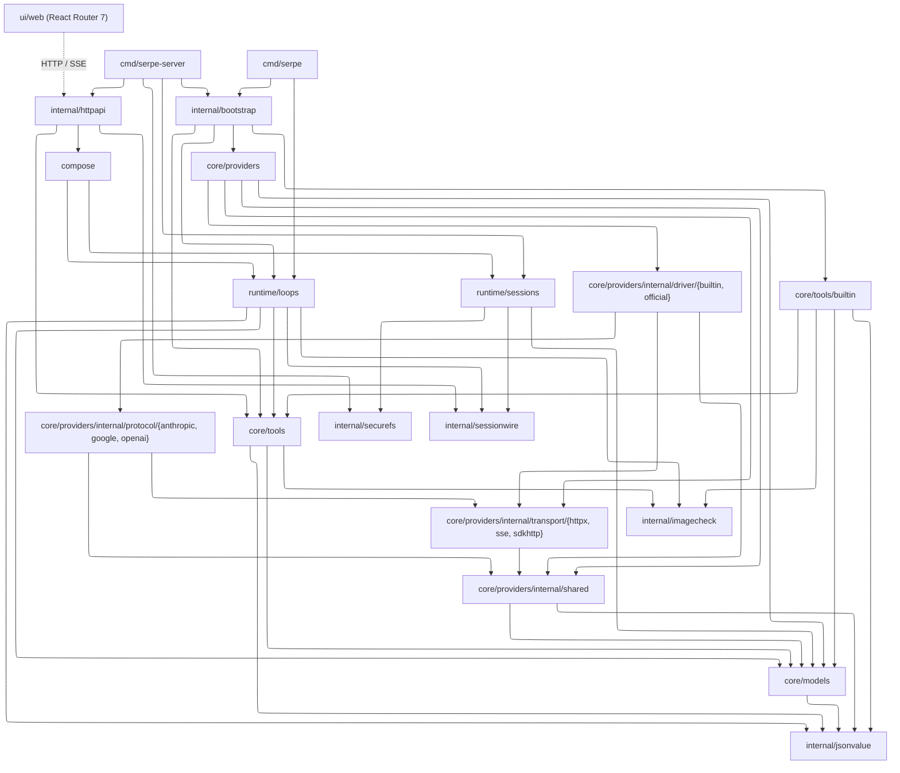
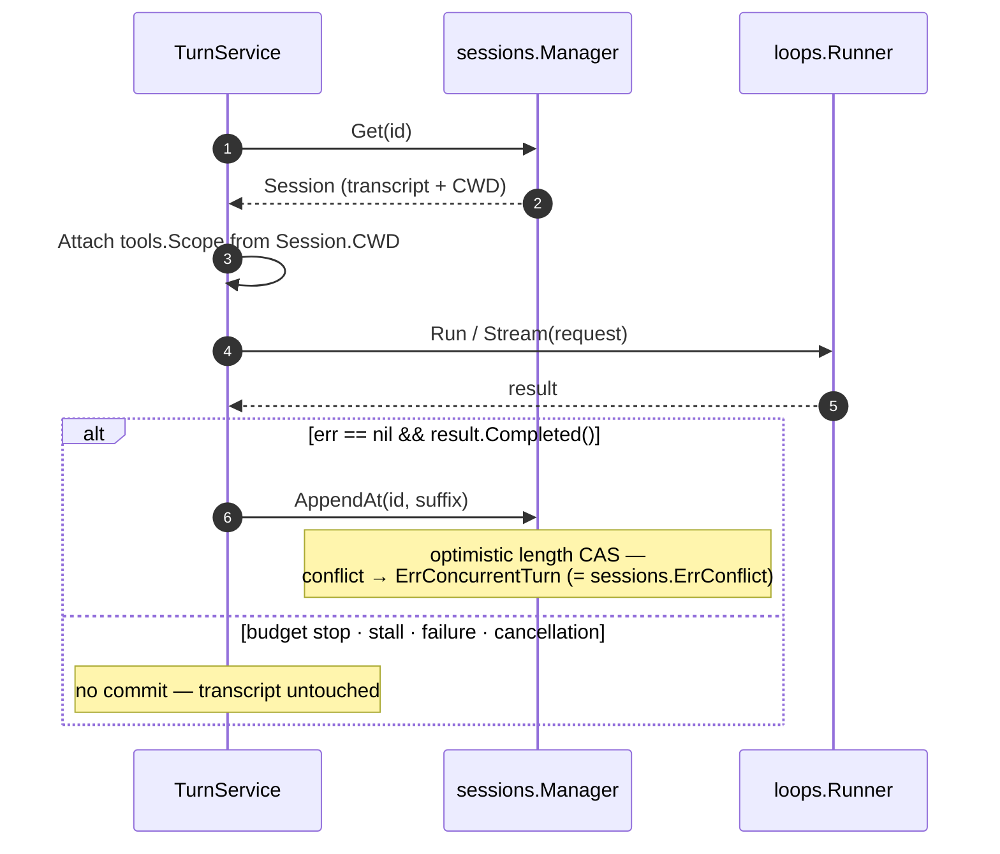

# serpe

Serpe is an agent harness: it owns the loop around a model — assembling
context, streaming responses, executing tool calls, appending their results,
and repeating until the run stops.

## Dependency graph



Solid arrows are the primary Go dependency paths (transitive imports
omitted).

| Seam | Rule |
|---|---|
| `runtime/sessions` | imports neither `runtime/loops` nor `core/providers` — the loop is store- and provider-agnostic |
| `compose` | the application seam: joins `loops.Runner` with `sessions.Manager` into one turn boundary; each turn attaches `tools.Scope` from `Session.CWD` |
| `internal/httpapi` | takes one `Runner`/`Manager` pair and builds its own `TurnService` — CRUD and runs always share one store |
| `internal/bootstrap` | owns provider/model construction; composition roots pass already-selected tools |
| `core/tools` | immutable Executor: registry, schema, batch scheduling, output limits |
| `core/tools/builtin` | local `read`/`write`/`edit`/`bash`, default-enabled, confined to the working directory |
| `internal/jsonvalue` | leaf used by `core/models`, `core/tools`, `runtime/loops`, `internal/httpapi`, and provider internals |
| `internal/imagecheck` | bounded, structural validation shared by tool output and model-result projection |
| `internal/securefs` | no-follow opens and private owner/permission checks for FileStore |
| `internal/sessionwire` | one exact JSON-size authority shared by sessions, runtime, and HTTP detail pages |

## Modules

### `core/models`

`Request`/`Response`, the streaming `Event` type, `Tool`/`ToolCall`/
`ToolChoice` (provider-wire DTOs, not executors), the `Model` invocation
interface, optional capability and definition-validator reporters, and
canonical `Content` validation, encoding, and equality.

```go
request := models.NewTextRequest("Summarize this repository.")
request.Instructions = []models.Instruction{{
    Role: models.InstructionDeveloper,
    Text: "Answer in three concise bullets.",
}}
request.Generation.MaxOutputTokens = models.Some(300)
if err := request.Validate(); err != nil {
    log.Fatal(err)
}
```

### `core/tools`

Register `tools.Tool` implementations on an immutable `tools.Executor`.
`models.Tool` is the provider-wire definition; `tools.Tool` is the
executable capability. The Executor owns schema validation, batch
planning, cross-batch resource serialization, and per-call/batch output
limits. Tools that omit `Planner` take a global write lock and run serially;
pure planners can expose independent work to the bounded scheduler, while an
optional `Activator` resolves mutable aliases immediately before execution.
`Output{IsError:true}` (or `tools.Error` / `tools.Reject`) is
model-recoverable; a non-nil Go error is fatal and stops the batch.

```go
exec, err := tools.New(tools.Config{}, myTool{})
runner, err := loops.New(loops.Config{Model: model, Tools: exec})
```

Tool side effects are not transactional with the transcript: a later stop
or failure does not undo writes or commands. Output finalization bounds what
the Executor retains and sends; a custom in-process Tool must still bound its
own CPU, I/O, and allocations before it returns.

### `core/tools/builtin`

`read`, `write`, `edit`, and `bash`, enabled by default and confined to the
bound working directory. `builtin.NewDefault` builds the four; `Set.Select`
filters by name. Both `cmd/serpe` and `cmd/serpe-server` enable all four by
default; the server's `--tools` flag can restrict the set or disable it
with `none`.

`bash` is not a sandbox. It runs `bash --noprofile --norc -c` as the
Serpe user with the process environment and can reach anything that OS
identity can. Cancellation contains the process group on Unix and a Job
Object on Windows, but hostile code still requires a container or another
real isolation boundary. File tools confine resolved paths to the working
directory; that policy does not apply to `bash` or arbitrary contributed
Tools.

### `core/providers`

Built-in and official SDK drivers; Anthropic, Google, and OpenAI codecs;
shared helpers; HTTP/SSE/SDK transports.

Minimal OpenAI Responses call (with `OPENAI_API_KEY` set):

```go
provider, err := providers.New(providers.Config{
    Protocol: providers.OpenAIResponses,
    APIKey:   os.Getenv("OPENAI_API_KEY"),
})
if err != nil {
    log.Fatal(err)
}
model, err := provider.ResolveModel("gpt-5.6-luna")
if err != nil {
    log.Fatal(err)
}
response, err := model.Complete(
    context.Background(),
    models.NewTextRequest("Say hello in one sentence."),
)
if err != nil {
    log.Fatal(err)
}
fmt.Println(response.Text())
```

### `runtime/loops`

`Runner` binds one `models.Model` to an optional `*tools.Executor`.
`Runner.Run` (one-shot) and `Runner.Stream` (streaming) advance a pull
state machine over the `Stream` interface: each `Next()` yields one
`Event`. The package owns the model–tool loop, run limits, stall
detection, and run / model / tool lifecycle events. Request `Tools` must
be empty; definitions are snapshotted from the Executor at construction.
Older tool exchanges may be summarized in the request sent to the model;
the canonical transcript is not rewritten.


Only completed runs are committable. Limit and stall stops return a partial
result with a nil error; failures return a partial result with a non-nil
error (`Runner.Run`'s second return, or `Stream.Err()`).

Minimal blocking run with a configured model and one tool:

```go
exec, err := tools.New(tools.Config{}, now)
if err != nil {
    log.Fatal(err)
}
runner, err := loops.New(loops.Config{Model: model, Tools: exec})
if err != nil {
    log.Fatal(err)
}
result, err := runner.Run(ctx, models.NewTextRequest("What time is it?"))
if err == nil && result.Completed() {
    fmt.Println(result.Text())
}
```

### `runtime/sessions`

`Session`; a `Manager` for validation, a versioned record codec, per-ID
transactions, CRUD, forking, metadata changes, and appends; `MemoryStore` or
`FileStore` (cross-process exclusive lock, v2 lowercase filename codec, and
atomic create/replace publish).

```go
manager, _ := sessions.NewManager(sessions.NewMemoryStore(), sessions.Limits{})
defer func() { _ = manager.Close() }()
created, _ := manager.Create(ctx, sessions.New("sess-1", "/work"))
_, _ = manager.Append(ctx, created.ID,
    models.NewUserMessage(models.Text("What is in this repo?")),
    models.NewAssistantMessage(models.Text("Let me look.")),
)
```

```go
// Root must already exist, be absolute, private, and owned by this identity.
store, err := sessions.NewFileStore("/var/lib/serpe/sessions")
if err != nil {
    log.Fatal(err)
}
manager, err := sessions.NewManager(store, sessions.Limits{})
if err != nil {
    _ = store.Close() // ownership transfers only on successful construction
    log.Fatal(err)
}
defer func() { _ = manager.Close() }()
```

- IDs: 1–128 ASCII `[A-Za-z0-9._-]`; `.`, `..`, and Windows reserved device names are rejected.
- Custom `Store`s persist opaque `[]byte` records keyed by ID and never decode `Session`; `Manager` owns validation and the versioned payload.
- Mutations are intent-specific (`Patch`, `Append`, `AppendAt`) — there is no generic `Update`.
- A successful `NewManager` exclusively owns the Store until idempotent `Manager.Close`; if construction fails, the caller still owns and closes it.
- `FileStore` accepts one active opener, pins child access to the validated root
  directory handle, rejects links/reparse points and broad permissions, and
  initializes its format marker only in an empty root.

On Unix, create the root as the service identity with mode `0700`, for example
`install -d -m 700 /var/lib/serpe/sessions`. On Windows, remove inherited
access and grant only the owning identity, Local System, and Administrators;
the same private ACL rule applies to records created beneath it.

### `compose`



```go
svc, _ := compose.New(compose.Config{
    Runner: runner, Manager: manager,
})
result, session, err := svc.Send(ctx, "sess-1", "What is in this repo?")
// or streaming:
turn, _ := svc.Stream(ctx, "sess-1", prompt)
for turn.Next() { /* events */ }
```

Each turn attaches `tools.Scope{WorkingDir: session.CWD}` before the run.
File tools confine paths to that working directory.

Streaming: the commit decision happens before `run_end` is published, so no
extra `Next()` is needed to persist; after `run_end`, check `Turn.Err()` for
terminal errors, including commit failures. `Turn.Close()` never commits.

### `internal/httpapi` + `cmd/serpe-server`

| Method | Path | Notes |
|---|---|---|
| GET | `/api/health` | |
| GET · POST | `/api/sessions` | ID-ordered bounded list · create |
| GET · PATCH · DELETE | `/api/sessions/{id}` | GET supports snapshot message pagination |
| POST | `/api/sessions/{id}/fork` | |
| POST | `/api/runs` | `text/event-stream` over `TurnService.Stream` |

The runs endpoint opens the turn (loading the session) before writing SSE
headers, so lookup/validation errors still return as JSON. Browser-side wire
types live in `ui/web/app/lib/wire.ts`; Go and TypeScript tests share
`contracts` fixtures.

The server enables all four local tools by default. `--tools`/`SERPE_TOOLS`
restricts the set; `none` disables them. Every file call is bound to
`Session.CWD`, and `bash` runs with the server's process identity.

```go
srv, _ := httpapi.New(httpapi.Config{
    Runner: runner, Manager: manager, CWD: "/work",
    ListenAddress: "127.0.0.1:8080",
})
```

```bash
# API on 127.0.0.1:8080; MemoryStore unless configured.
go run ./cmd/serpe-server

# Web dev server (proxies /api → http://127.0.0.1:8080)
cd ui/web && pnpm install && pnpm run dev
```

| Env var | Used by | Meaning |
|---|---|---|
| `OPENAI_API_KEY` | CLI, server | required |
| `OPENAI_BASE_URL` | CLI, server | optional override |
| `OPENAI_DEFAULT_MODEL` | CLI, server | required — selects the model |
| `SERPE_ADDR` | server | IP-literal listen address (default `127.0.0.1:8080`) |
| `SERPE_CWD` | server | default session CWD (default: process cwd) |
| `SERPE_SESSIONS_DIR` | server | existing absolute private FileStore root; unset → MemoryStore |
| `SERPE_TOOLS` | server | optional restriction from `read,write,edit,bash`; empty enables all four; `none` disables local tools |
| `SERPE_API_ORIGIN` | web | backend origin (default `http://127.0.0.1:8080`) |

#### FileStore migration

The v2 FileStore layout is intentionally not an online fallback for legacy
raw-ID filenames or relative session CWDs. Stop every server using the root,
keep an external backup, and run an explicit dry-run with two absolute paths:

```bash
go run ./cmd/serpe-server migrate-store \
  --store-root /absolute/sessions \
  --cwd-base /absolute/legacy-cwd-base

go run ./cmd/serpe-server migrate-store \
  --store-root /absolute/sessions \
  --cwd-base /absolute/legacy-cwd-base \
  --apply
```

Apply first creates and verifies a private backup manifest, then publishes the
v2 marker last. Preserve the JSON report: it contains exact absolute restore
and cleanup commands. If apply stops partway, run the reported `--restore`
command before restarting. After verifying the migrated server, remove only
the verified backup with the reported `--cleanup` command; cleanup refuses
unknown files, links, or checksum changes.

#### Upgrade notes

- `sessions.NewManager` now requires `sessions.Limits{}` and takes exclusive
  Store lifecycle ownership on success; `Store` implementations must provide
  `Close` and bounded `ListIDsPage`.
- FileStore uses a format marker and lowercase base32 v2 record names. Legacy
  roots require the offline migration above; a second active opener fails.
- Session lists are ID-ordered and paginated. Detail responses may include
  snapshot pagination fields, and successful oversized mutations may return a
  bounded acknowledgment with `messages_omitted` and `detail_url`.
- Parallel tool events are correlated by call ID/index: starts and ends need
  not be adjacent, ends may be out of order, and skipped calls emit no event.

### `cmd/serpe`

Thin CLI: arguments and event rendering only — wiring lives in
`internal/bootstrap`, the model–tool loop in `runtime/loops`. It enables
the four local tools and attaches the process working directory as
`tools.Scope`. `bash` runs as the Serpe user.

```bash
go run ./cmd/serpe "Summarize this repo"
```

## License

MIT
