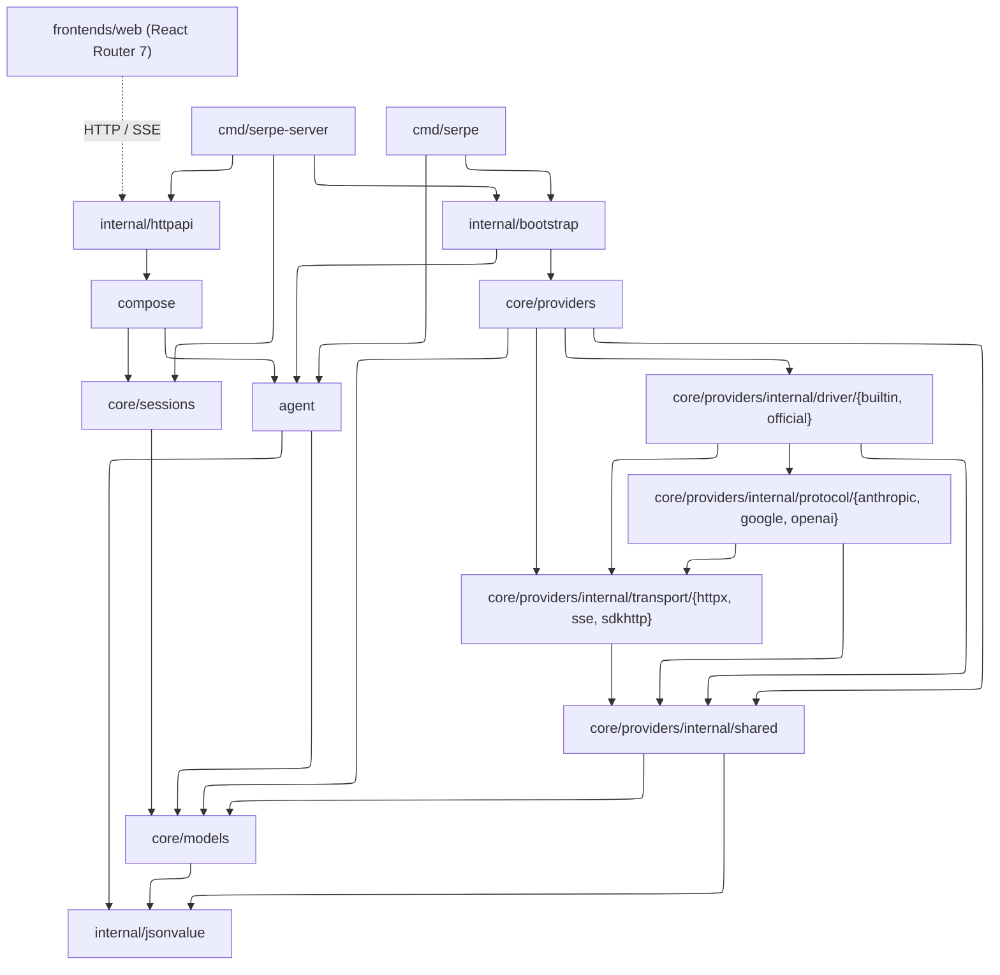
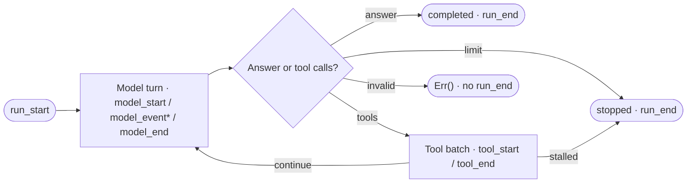
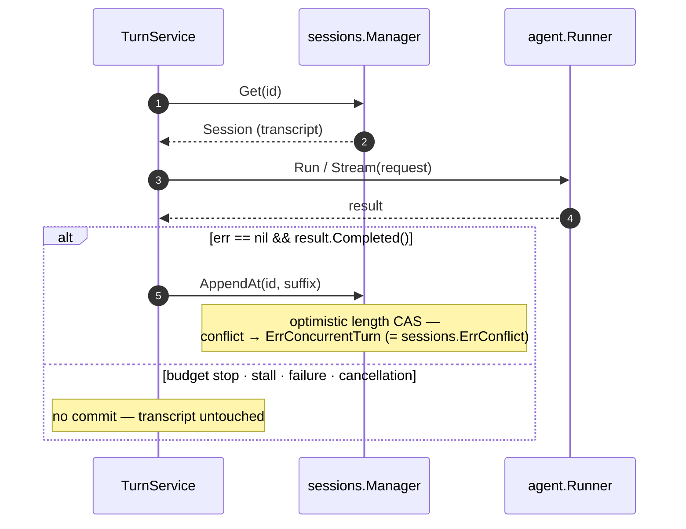

# serpe

Serpe is an agent harness: it owns the loop around a model — assembling
context, streaming responses, executing tool calls, appending their results,
and repeating until the run stops.

## Dependency graph



Solid arrows are the primary Go dependency paths (transitive imports
omitted).

| Seam | Rule |
|---|---|
| `agent` | imports neither `core/sessions` nor `core/providers` — the loop is store- and provider-agnostic |
| `compose` | the application seam: joins `agent.Runner` with `sessions.Manager` into one turn boundary |
| `internal/httpapi` | takes one `Runner`/`Manager` pair and builds its own `TurnService` — CRUD and runs always share one store |
| `internal/bootstrap` | owns provider/model/tool construction shared by both commands |
| `internal/jsonvalue` | leaf used by `core/models`, `agent`, `internal/httpapi`, and provider internals |

## Modules

### `core/models`

`Request`/`Response`, the streaming `Event` type, `Tool`/`ToolCall`/
`ToolChoice`, the `Model` invocation interface, and canonical `Content`
validation, encoding, and equality.

```go
request := models.NewTextRequest("Summarize this repository.")
request.Instructions = []models.Instruction{{
    Role: models.InstructionDeveloper,
    Text: "Answer in three concise bullets.",
}}
request.Generation.MaxOutputTokens = models.Some(300)
if err := request.Validate(); err != nil {
    log.Fatal(err)
}
```

### `core/providers`

Built-in and official SDK drivers; Anthropic, Google, and OpenAI codecs;
shared helpers; HTTP/SSE/SDK transports.

Minimal OpenAI Responses call (with `OPENAI_API_KEY` set):

```go
provider, err := providers.New(providers.Config{
    Protocol: providers.OpenAIResponses,
    APIKey:   os.Getenv("OPENAI_API_KEY"),
})
if err != nil {
    log.Fatal(err)
}
model, err := provider.ResolveModel("gpt-5.6-luna")
if err != nil {
    log.Fatal(err)
}
response, err := model.Complete(
    context.Background(),
    models.NewTextRequest("Say hello in one sentence."),
)
if err != nil {
    log.Fatal(err)
}
fmt.Println(response.Text())
```

### `agent`

`Runner.Run` (one-shot) and `Runner.Stream` (streaming) advance a pull
state machine over the `Stream` interface: each `Next()` yields one `Event`.
The package also defines the `Tool`/`ToolOutput` contract, run limits, and
run / model / tool lifecycle events.



Only completed runs are committable. Limit and stall stops return a partial
result with a nil error; failures return a partial result through `Err()`.

Minimal blocking run with a configured model and one tool:

```go
runner, _ := agent.NewRunner(agent.Config{
    Model: model,
    Tools: []agent.Tool{now},
})
result, err := runner.Run(ctx, models.NewTextRequest("What time is it?"))
if err == nil && result.Completed() {
    fmt.Println(result.Text())
}
```

### `core/sessions`

`Session`; a `Manager` for validation, a versioned record codec, per-ID
transactions, CRUD, forking, metadata changes, and appends; `MemoryStore` or
`FileStore` (atomic temp-file publish, `<root>/<id>.json`).

```go
manager, _ := sessions.NewManager(sessions.NewMemoryStore())
created, _ := manager.Create(ctx, sessions.New("sess-1", "/work"))
_, _ = manager.Append(ctx, created.ID,
    models.NewUserMessage(models.Text("What is in this repo?")),
    models.NewAssistantMessage(models.Text("Let me look.")),
)
```

```go
// Root must already exist and be writable; single-process use.
store, _ := sessions.NewFileStore("/var/lib/serpe/sessions")
manager, _ := sessions.NewManager(store)
```

- IDs: 1–128 ASCII `[A-Za-z0-9._-]`; `.`, `..`, and Windows reserved device names are rejected.
- Custom `Store`s persist opaque `[]byte` records keyed by ID and never decode `Session`; `Manager` owns validation and the versioned payload.
- Mutations are intent-specific (`SetCWD`, `PatchMetadata`, `Append`, `AppendAt`) — there is no generic `Update`.

### `compose`



```go
svc, _ := compose.New(compose.Config{Runner: runner, Manager: manager})
result, session, err := svc.Send(ctx, "sess-1", "What is in this repo?")
// or streaming:
turn, _ := svc.Stream(ctx, "sess-1", prompt)
for turn.Next() { /* events */ }
```

Streaming: the commit decision happens before `run_end` is published, so no
extra `Next()` is needed to persist; after `run_end`, check `Turn.Err()` for
terminal errors, including commit failures. `Turn.Close()` never commits.

### `internal/httpapi` + `cmd/serpe-server`

| Method | Path | Notes |
|---|---|---|
| GET | `/api/health` | |
| GET · POST | `/api/sessions` | list · create |
| GET · PATCH · DELETE | `/api/sessions/{id}` | |
| POST | `/api/sessions/{id}/fork` | |
| POST | `/api/runs` | `text/event-stream` over `TurnService.Stream` |

The runs endpoint opens the turn (loading the session) before writing SSE
headers, so lookup/validation errors still return as JSON. Browser-side wire
types live in `frontends/web/app/lib/wire.ts`; Go and TypeScript tests share
`api/examples` fixtures.

```go
srv, _ := httpapi.New(httpapi.Config{
    Runner: runner, Manager: manager, CWD: "/work",
})
```

```bash
# API (:8080 by default; MemoryStore unless SERPE_SESSIONS_DIR is set)
go run ./cmd/serpe-server

# Web dev server (proxies /api → http://127.0.0.1:8080)
cd frontends/web && npm install && npm run dev
```

| Env var | Used by | Meaning |
|---|---|---|
| `OPENAI_API_KEY` | CLI, server | required |
| `OPENAI_BASE_URL` | CLI, server | optional override |
| `OPENAI_DEFAULT_MODEL` | CLI, server | required — selects the model |
| `SERPE_ADDR` | server | listen address (default `:8080`) |
| `SERPE_CWD` | server | default session CWD (default: process cwd) |
| `SERPE_SESSIONS_DIR` | server | file-store root; unset → MemoryStore |
| `SERPE_API_ORIGIN` | web | backend origin (default `http://127.0.0.1:8080`) |

### `cmd/serpe`

Thin CLI: arguments and event rendering only — wiring lives in
`internal/bootstrap`, the model–tool loop in `agent`.

```bash
go run ./cmd/serpe "Summarize this repo"
```

## License

MIT
